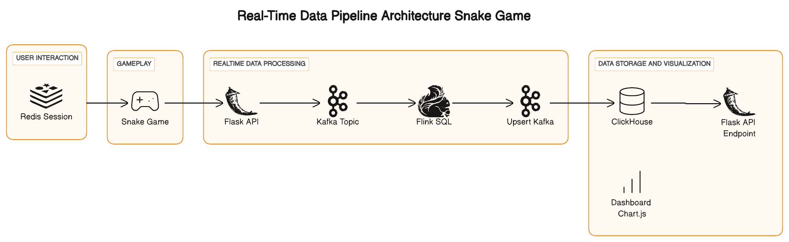
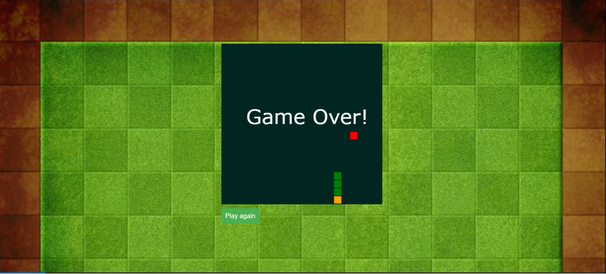
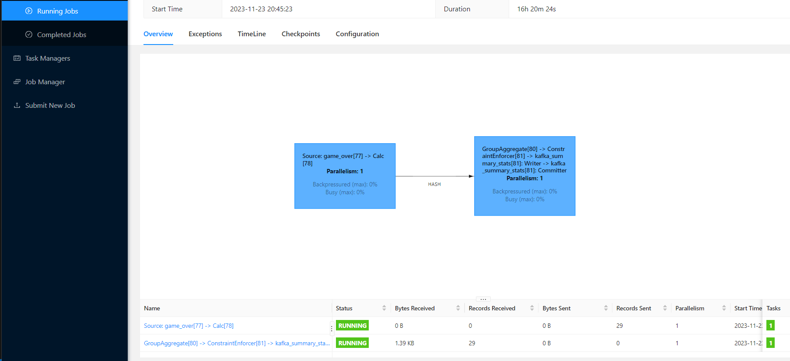
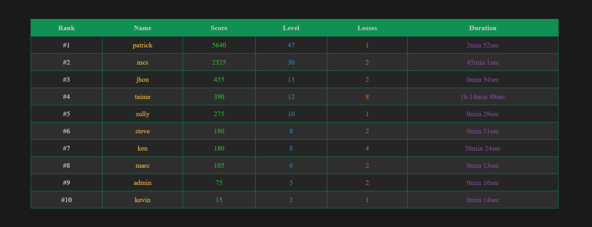

# Real-Time Data Pipeline for Snake Game


## Getting Started

### Prerequisites

- **Confluent Cloud Account**: If you do not have a Confluent Cloud account, you can [create one here](https://www.confluent.io/confluent-cloud/tryfree/). It's free for a trial period of more than 30 days, and no credit card is required.
- - **clickhouse Cloud**: You can also try clickhouse for free at [clickhouse Free Trial]([https://redis.com/try-free/](https://clickhouse.cloud/signUp?loc=doc-card-banner)).
- **Redis**: You can also try Redis for free at [Redis Free Trial](https://redis.com/try-free/).

Alternatively, if you prefer, you can deploy a local Kafka and Redis cluster using Docker Compose.

### Installation

1. Clone the repository:
   ```
   git clone https://github.com/Stefen-Taime/Real-Time-Data-Pipeline-Snake-Game.git
   ```
2. Navigate to the cloned directory:
   ```
   cd Real-Time-Data-Pipeline-Snake-Game
   ```
3. Your directory should look like this:
   ```
   .
   ├── app.py
   ├── dashboard
   │   ├── index.html
   │   ├── package.json
   │   ├── package-lock.json
   │   ├── scoreboard.css
   │   ├── scoreboard.js
   │   └── unnamed.png
   ├── Dockerfile
   ├── flink-cluster
   │   ├── docker-compose.yml
   │   ├── jobs
   │   │   └── job.sql
   │   ├── LICENSE
   │   ├── README.md
   │   └── sql-client
   │       └── Dockerfile
   ├── requirements.txt
   ├── static
   │   ├── img.jpg
   │   ├── snake.js
   │   └── style.css
   └── templates
       └── index.html
   ```

### Setting Up

1. Go to Confluent Cloud and create two topics: `game_over_topic` and `SUMMARY_STATS_TOPIC`.
2. In the `app.py` file, fill in the connection values for Redis and Kafka.
3. Build and start the Flask API and game server:
   ```
   docker build -t my-flask-app .
   docker run -p 5000:5000 my-flask-app
   ```
   Once done, navigate to `localhost:5000` to see the game interface.
   

### Running the Pipeline

1. In a separate terminal, navigate to the `flink-cluster` directory and start the Flink cluster locally:
   ```
   docker-compose up --build -d
   ```
2. Submit the Flink job:
   ```
   docker exec -it <container_id> /opt/flink/bin/sql-client.sh embedded -f job.sql
   ```
   You can check `localhost:8081` to see if the job is running correctly.
   

### Dashboard

1. Navigate to the `dashboard` directory and execute the dashboard application to view real-time player rankings:
   ```
   npm install chart.js
   python -m http.server
   ```
   Access it on port 8000. Refresh the page to switch users when playing on port 5000. You can also check your topics after each game over to view the data.
   
   
